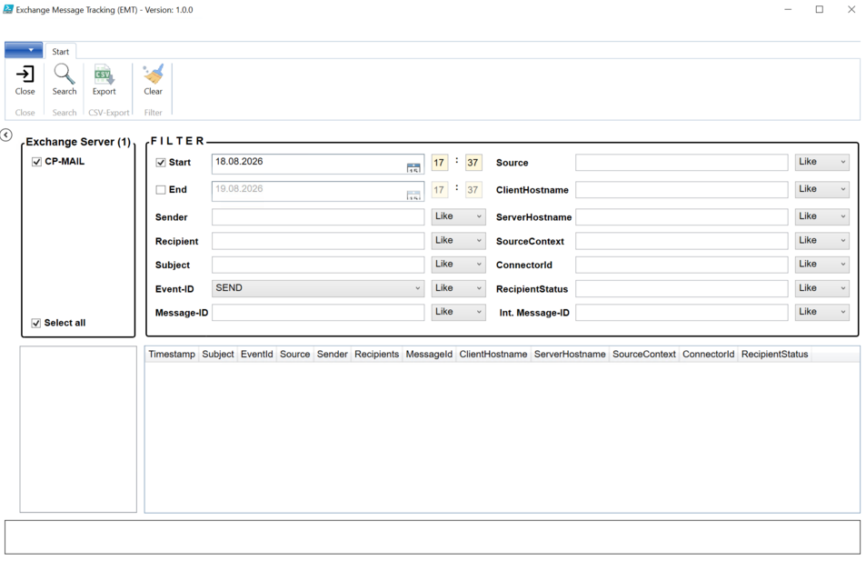

# Exchange Message Tracker

A PowerShell/WPF GUI application for searching and analyzing Exchange Message Tracking logs.



Text neben dem Bild...

## ⚠️ Warning

> Do not use in a production environment without thorough testing in a lab environment first. Use at your own risk.

## Description

Exchange Message Tracker provides a graphical interface (WPF) for querying Exchange servers and displaying message tracking data in a filterable DataGrid. Messages can be filtered by time range, sender, recipient, subject, message ID, and other criteria. Details for individual messages can be viewed via double-click, and results can be exported to CSV.

## Features

- Select multiple Exchange servers from a server list
- Time range filter (start/end time with date and hour/minute)
- Full-text filters for sender, recipient, subject, message ID, and more
- Detail view for individual messages via double-click
- CSV export of search results
- One-click filter reset
- Configuration via JSON files (`Style.json`, `MessageTracking.json`)

## Requirements

- Windows PowerShell (must be launched in STA mode: `powershell.exe -sta`)
- .NET Framework (for `PresentationFramework`, `PresentationCore`, `WindowsBase`)
- Permissions to query Exchange Message Tracking logs

## Directory Structure

```
├── config/
│   ├── Style.json
│   └── MessageTracking.json
├── images/
├── module/
├── xaml/
│   ├── MainForm.xaml
│   └── GetMessageDetail.xaml
└── ExchangeMessageTracker.ps1
```

## Usage

```powershell
Must be opened and run with Visual Studio Code or PowerShell ISE.
```

After launch:
1. Select Exchange server(s) from the list
2. Set a time range and/or filter criteria
3. Start the search
4. View, filter, or export results as CSV in the DataGrid

## Author

Andreas Werner

## Version

1.0.0 (as of 2026-08-18)
